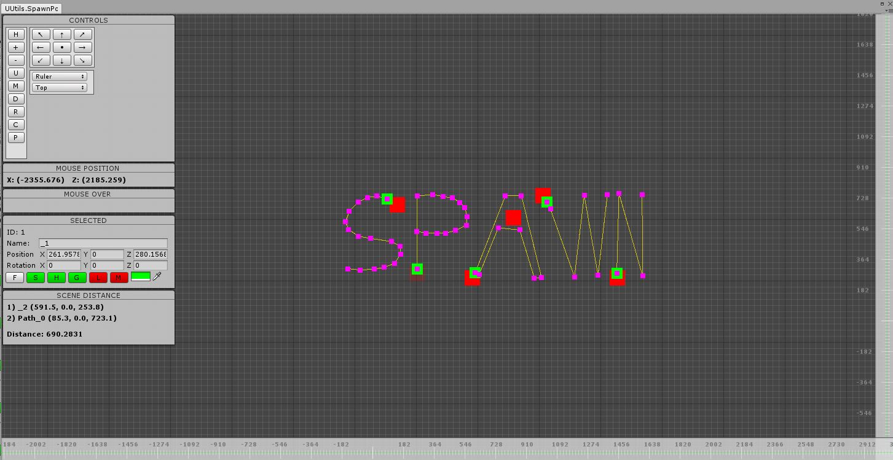
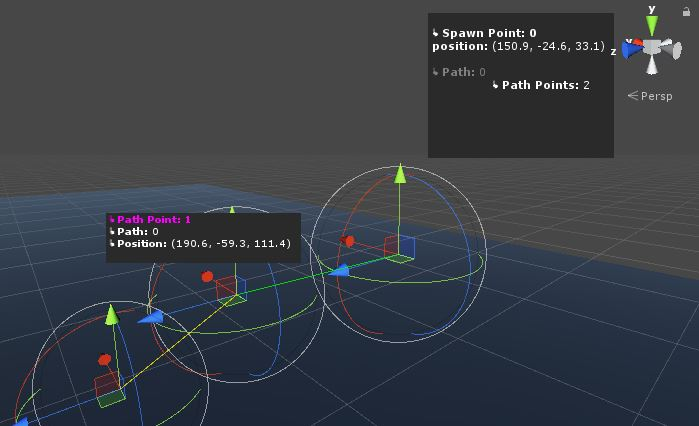

# spawn_points
Unity plugin for creating path systems.

Create paths using a 2D graph or clicking around while in scene view.
You can also preview a mesh at a path position so you can see what it would
look like during gameplay.
Paths are stored in a scriptable object so it's ver easy to transfer them
projects or creating new sets.

This project requires API compatibility level: .NET 4.x
You should set this by going to Edit->Project Settings->Player

Project has a documentation folder with a manual and API documentation
generated with Doxygen.

